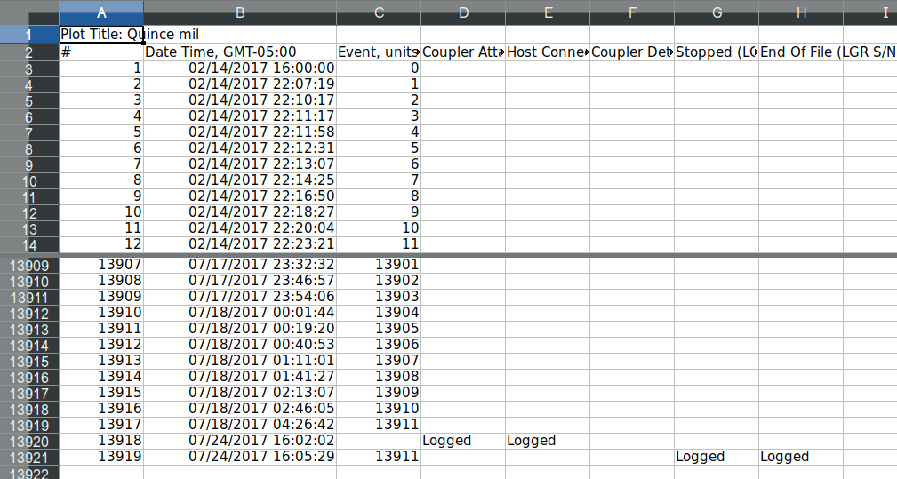
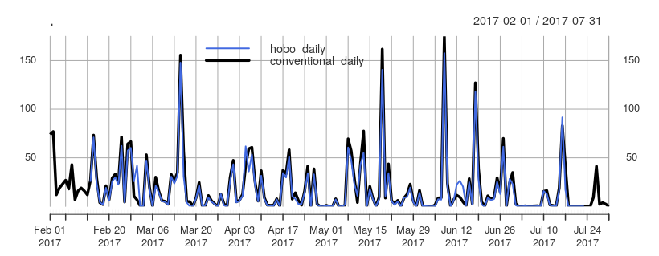

# hobo_rainfall

A rain gauge (pluviometer) is an instrument used to measure rainfall in a certain period of time and location. Rain gauges can be divided into two groups: non-recording and recording types. In the latter, three more subtypes exist and are known as weighing-bucket, tipping-bucket, and floating (or natural siphon) type rain gauge.

Here is shown the [comparison](http://jurnalinstrumentasi.bsn.go.id/index.php/ji/article/view/52/pdf_1) of a tipping-bucket rain gauge ([HOBO brand](http://www.hobodataloggers.com.au/hobo-data-logging-rain-gauge-rg3-m)) with the pluviometer used in [SENAMHI](https://www.senamhi.gob.pe/) (Hellman type, see [Andrade et al.](http://siar.minam.gob.pe/puno/sites/default/files/archivos/public/docs/atlas_clima_y_eventos_extremos_del_altiplano_central_peru_-boliviano.pdf) for more information). The tipping-bucket- (**hobo**) and hellman- type (**conventional**) were evaluated at daily scale in the **Quincemil** (**Cusco**) station area (**latidude: 13°13'1''S**, **longitude: 70°45'1''W**, **elevation: 651 msal**).

## Process

Raw output data of **hobo** has a typical format (Figure 1) where the more important variables are: Date Time and Event, which corresponds the time (Date Time) in which an event of rain happened and is registered as a pulse (Event). 

  

*Figure 1. Typycal format of a HOBO data logger*

To convert this rain pulse (count) to rain (mm), the following steps are needed: 

1. Each pulse has a value of 0.2 mm (0.254 in)

2. Events that occur in less than 1 second are not valid. If two events consecutively happened in 1 second, only the first one is preserved, i.e is set to 0 (DOUBLE FALSE)

3. Events that correspond to the time of installation and unloading of data should be set to 0 (INSTALLATION and DATA DOWNLOADING)

Taking into consideration the previous steps, it is possible to have a time series of rainfall at a sub-daily scale (seconds) that can be accumulated at higher scales. Comparing the processed **hobo** and **convential** is thus easy to perform (see **example.R**). A simple plot is carry out in the Figure 2.

  

  *Figure 2. Time series of daily rainfall for **hobo** and **conventional** data*

Is easy to see that **hobo** match really good with **conventional** for high and low values in the period time. The **mean bias is around -1.8 mm** and the **spearman correlation has a value of 0.97**. All this lets us know that **hobo** works great! However, more research has to be done!

## Acknowledgment

I really thanks to Boris Ochoa Tochachi who provides me the original .xls file with several considerations (mentioned in the Process section).